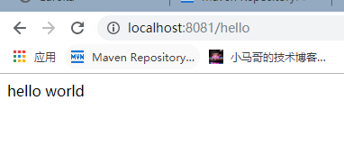

# springbootdemo

## 引入web依赖
~~~~xml
 <dependency>
    <groupId>org.springframework.boot</groupId>
    <artifactId>spring-boot-starter-web</artifactId>
</dependency>
~~~~
## 修改启动端口

`application.properties`中设置 `server.port=8081` 
> 如果不设置默认8080

##编写controller

~~~~java
@SpringBootApplication
@RestController
public class SpringBootHelloworldDemoApplication {

	public static void main(String[] args) {
		SpringApplication.run(SpringBootHelloworldDemoApplication.class, args);
	}

	@GetMapping("/hello")
	public String hello(){
		return "hello world";
	}

}
~~~~

## 启动
SpringBootHelloworldDemoApplication中，run即可

## 访问
http://localhost:8081/hello

