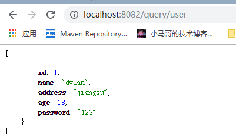

#springboot集成jdbc

##添加依赖
~~~~xml
<!--jdbc-->
<dependency>
    <groupId>org.springframework.boot</groupId>
    <artifactId>spring-boot-starter-data-jdbc</artifactId>
</dependency>

<!--mysql依赖-->
<dependency>
    <groupId>mysql</groupId>
    <artifactId>mysql-connector-java</artifactId>
    <scope>runtime</scope>
</dependency>

<!--web模块-->
<dependency>
    <groupId>org.springframework.boot</groupId>
    <artifactId>spring-boot-starter-web</artifactId>
</dependency>

~~~~

#编写查询代码
~~~~java
@SpringBootApplication
@RestController
public class SpringBootJdbcApplication {

	@Autowired
	private JdbcTemplate jdbcTemplate;

	public static void main(String[] args) {
		SpringApplication.run(SpringBootJdbcApplication.class, args);
	}

	@GetMapping("query/user")
	public Object queryUser(){
		return jdbcTemplate.queryForList("select * from user");
	}
}
~~~~

##访问
http://localhost:8082/query/user

