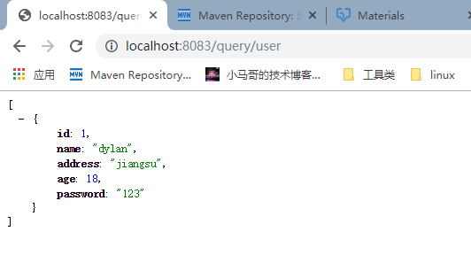

# 通过xml的形式使用mybatis

## 引入依赖
~~~~xml
 <dependency>
    <groupId>org.mybatis.spring.boot</groupId>
    <artifactId>mybatis-spring-boot-starter</artifactId>
    <version>2.1.3</version>
</dependency>

<!--还有其他的，mysql，web等模块，见pom.xml-->
~~~~

### 1. 配置扫描注解
在SpringBootMybatisXmlApplication上添加注解`@MapperScan（com.demo.springbootmybatisxml.dao）`
用于扫描mapper类包的路径

### 2.配置数据源及mybatis
~~~~yml
spring:
  datasource:
    url: jdbc:mysql://49.235.29.59:3301/test?useUnicode=true&characterEncoding=UTF-8&useSSL=false&allowPublicKeyRetrieval=true
    username: root
    password: root
    driver-class-name: com.mysql.cj.jdbc.Driver
server:
  port: 8083
mybatis:
#配置xml文件位置
  mapper-locations: classpath:mybatis/mapper/*.xml
~~~~

#### 3.配置mapper.xml文件
在resources下，新建文件夹 mybatis/mapper，创建UserMapper.xml (注意需要和dao下面的java文件名对应)
~~~~xml
<?xml version="1.0" encoding="UTF-8"?>
<!DOCTYPE mapper PUBLIC "-//mybatis.org//DTD Mapper 3.0//EN" "http://mybatis.org/dtd/mybatis-3-mapper.dtd">
<!--对应的接口映射空间-->
<mapper namespace="com.demo.springbootmybatisxml.dao.UserMapper">
    <!--数据库字段类型与java类型映射-->
    <resultMap id="BaseResultMap" type="com.demo.springbootmybatisxml.model.User">
        <id column="id" jdbcType="INTEGER" property="id"/>
        <result column="name" jdbcType="VARCHAR" property="name"/>
        <result column="address" jdbcType="VARCHAR" property="address"/>
        <result column="age" jdbcType="INTEGER" property="age"/>
        <result column="password" jdbcType="VARCHAR" property="password"/>
    </resultMap>

<!--sql语句-->
    <select id="queryUser" resultMap="BaseResultMap">
        select * from user;
    </select>
</mapper>

~~~~

#### 4.编写代码
略：详见controller，dao，model部分

#### 5. 启动
访问 http://localhost:8083/query/user

