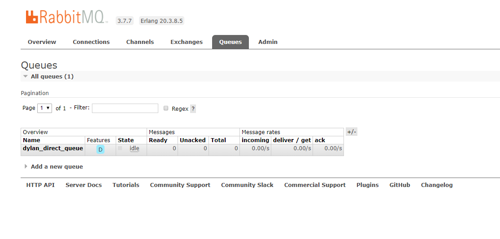
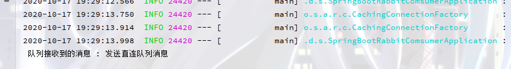

#介绍
1. spring-boot-rabbit-producer  消息生产者，发送消息到队列中
2. spring-boot-rabbit-consumer  消费者 监听队列，处理消息

## 开始

###1.设置队列 
配置直连队列  `dylan_direct_queue`

###2. 消费者consumer

引入依赖
~~~~xml
<dependency>
    <groupId>org.springframework.boot</groupId>
    <artifactId>spring-boot-starter-amqp</artifactId>
    <version>2.3.4.RELEASE</version>
</dependency>
~~~~

编写java代码，监听 队列`dylan_direct_queue`
~~~~java
@Component
@RabbitListener(queues = "dylan_direct_queue")
public class RabbitConsumer {

	@RabbitHandler
	public void process(String msg) throws IOException {
		System.out.println(" 队列接收到的消息 : " + msg);
	}
}
~~~~

配置文件
~~~~properties
server.port=8062
spring.rabbitmq.host=49.235.29.59
spring.rabbitmq.port=5672

~~~~

###3. 生产者producer

引入依赖
~~~~xml
<dependency>
    <groupId>org.springframework.boot</groupId>
    <artifactId>spring-boot-starter-amqp</artifactId>
    <version>2.3.4.RELEASE</version>
</dependency>
~~~~

向队列发送消息

~~~~java
@GetMapping("/send")
public Object send(){
    rabbitTemplate.convertAndSend("dylan_direct_queue","发送直连队列消息");
    return "发送成功";
}
~~~~

### 4. 启动
分别启动 consumer , producer

访问 http://localhost:8063/send

查看consumer控制台

