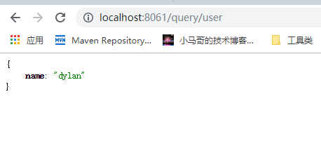

#简单实用redis

## 引入依赖

~~~~xml
 <dependency>
    <groupId>org.springframework.boot</groupId>
    <artifactId>spring-boot-starter-data-redis</artifactId>
</dependency>
~~~~

## 添加配置
~~~properties
spring.redis.host=49.235.29.59
spring.redis.port=6379
~~~

### 实现保存及删除
~~~~java
@Autowired
private RedisTemplate redisTemplate;

@GetMapping("/save/user")
public Object saveUser(){
    String user = "{\n" +
            "  \"name\": \"dylan\"\n" +
            "}";

    redisTemplate.opsForValue().set("user",user);
    return "成功";
}

@GetMapping("/query/user")
public Object queryUser(){
    return redisTemplate.opsForValue().get("user");
}
~~~~
### 运行并查看结果

执行保存   http://localhost:8061/save/user

 查询刚刚的记录  http://localhost:8061/query/user

