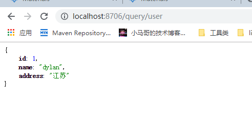
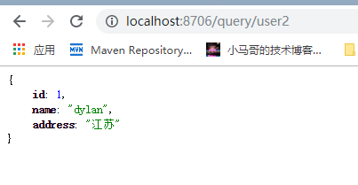

# 使用openfeign

##添加依赖
~~~~xml
<dependency>
    <groupId>org.springframework.cloud</groupId>
    <artifactId>spring-cloud-starter-openfeign</artifactId>
</dependency>
~~~~

## 配置
~~~~yaml
server:
  port: 8706
spring:
  application:
    name: openfeign-demo
eureka:
  instance:
    hostname: localhost
  client:
    service-url:
      defaultZone: http://${eureka.instance.hostname}:8701/eureka
~~~~

##扫描注解
~~~~
@EnableFeignClients(basePackages = "com.demo.springclouduseropenfeigndemo")
~~~~

##feignclient

调用 `user-server`  接口 `/query/user`

~~~~java
@FeignClient(name = "user-server")
public interface UserFeignClient {

	@GetMapping("/query/user")
	Object queryUser();
}
~~~~

##暴露接口
~~~~java
@Autowired
private UserFeignClient userFeignClient;
@GetMapping("query/user")
public Object queryUser(){
    return userFeignClient.queryUser();
}
~~~~

## 启动服务
http://localhost:8706/query/user

## 第二种方法直接调用接口
~~~~java
@Bean
public RestTemplate restTemplate(){
    return new RestTemplate();
}
@Autowired
private RestTemplate restTemplate;

@GetMapping("query/user2")
public Object queryUser2(){
    return restTemplate.getForEntity("http://localhost:8705/query/user", Object.class);
}
~~~~
访问http://localhost:8706/query/user2 查看效果

**不同点**

resttemlate通过地址直接取访问

openfeign通过注册中心获取目标服务的地址，再访问，无需维护地址
