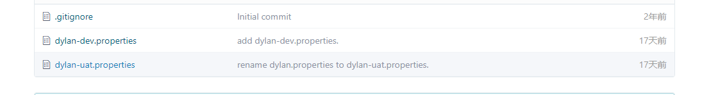
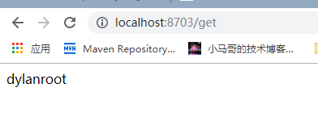
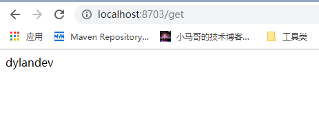

# 设置配置中心

## 1.创个git远程仓库

a. 创建远程仓库 `https://gitee.com/dylanthomas/one`

b. 创建文件`dylan-uat.properties`

~~~~properties
dylan.name=dylanroot
~~~~

c. 创建文件 `dylan-dev.properties`

~~~~properties
dylan.name = dylandev
~~~~

截图如下

##2. 创建项目并引入依赖
~~~~xml
<dependency>
    <groupId>org.springframework.cloud</groupId>
    <artifactId>spring-cloud-config-server</artifactId>
</dependency>
<dependency>
    <groupId>org.springframework.cloud</groupId>
    <artifactId>spring-cloud-starter-netflix-eureka-client</artifactId>
</dependency>
~~~~

###3. 自动注入
~~~~java
@SpringBootApplication
@EnableDiscoveryClient
@EnableConfigServer
public class SpringCloudConfigServerApplication {

	public static void main(String[] args) {
		SpringApplication.run(SpringCloudConfigServerApplication.class, args);
	}

}
~~~~
###4. 编写配置文件
注意： 关于eureka的配置需要放在bootstrap.yml中
       启动时，bootstrap优先于application.yml加载

~~~~yaml
server:
  port: 8702
eureka:
  instance:
    hostname: localhost
    port: 8701
  client:
    service-url:
      defaultZone: http://${eureka.instance.hostname}:${eureka.instance.port}}/eureka
    register-with-eureka: false
    fetch-registry: false
spring:
  application:
    name: eureka-config-server
  cloud:
    config:
      server:
        git:
          uri: https://gitee.com/dylanthomas/one
          search-paths: respo
#          username:
#          password:
      label: master
~~~~

##5. 创建config client模块

引入eureka client ,config client依赖
~~~~xml
<dependency>
    <groupId>org.springframework.cloud</groupId>
    <artifactId>spring-cloud-starter-config</artifactId>
</dependency>
<dependency>
    <groupId>org.springframework.cloud</groupId>
    <artifactId>spring-cloud-starter-netflix-eureka-client</artifactId>
</dependency>
~~~~

获取变量`dylan.name`
~~~~java
@SpringBootApplication
@EnableDiscoveryClient
@RestController
public class SpringCloudConfigClientApplication {

	public static void main(String[] args) {
		SpringApplication.run(SpringCloudConfigClientApplication.class, args);
	}

	@Value("${dylan.name}")
	private String value;

	@GetMapping("/get")
	public Object get(){
		return value;
	}
}
~~~~~

配置文件
~~~~yaml
server:
  port: 8703
spring:
  application:
    name: config-client
  cloud:
    config:
      uri: http://127.0.0.1:8702
      label: master
      profile: uat
      name: dylan
      enabled: true
eureka:
  instance:
    hostname: localhost
  client:
    service-url:
      defaultZone: http://${eureka.instance.hostname}:8701/eureka
~~~~

设置 spring.cloud.config.profile = uat
 
访问 http://localhost:8703/get ，结果

再设置 spring.cloud.config.profile = dev
 
访问 http://localhost:8703/get ，结果

