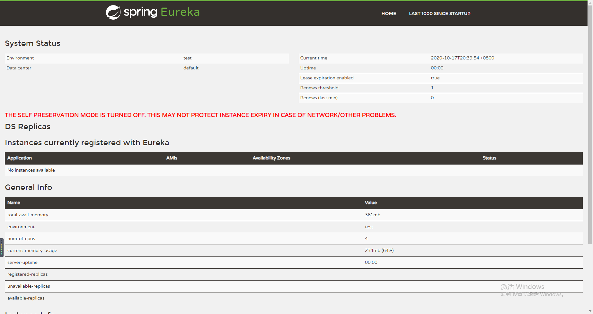

# spring cloud eureka 注册中心

## 引入依赖
~~~~xml
 <dependency>
    <groupId>org.springframework.cloud</groupId>
    <artifactId>spring-cloud-starter-netflix-eureka-server</artifactId>
</dependency>

~~~~

## 设置配置文件 application.yml
~~~~yaml
server:
  port: 8701

eureka:
  instance:
    hostname: localhost
  client:
    registerWithEureka: false
    fetchRegistry: false
    serviceUrl:
      defaultZone: http://${eureka.instance.hostname}:${server.port}/eureka/
  server:
    enable-self-preservation: false
    eviction-interval-timer-in-ms: 30000
spring:
  application:
    name: eureka-server
~~~~

## 添加enable注册
~~~~java
@SpringBootApplication
//自动装配eureka server模块
@EnableEurekaServer
public class SpringCloudEurekaServerApplication {

	public static void main(String[] args) {
		SpringApplication.run(SpringCloudEurekaServerApplication.class, args);
	}

}
~~~~

## 启动
http://localhost:8701/

效果

