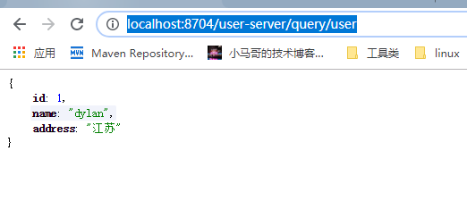

# 网关

## 1.引入依赖
~~~~xml
<!--网关-->
<dependency>
    <groupId>org.springframework.cloud</groupId>
    <artifactId>spring-cloud-starter-gateway</artifactId>
</dependency>
~~~~

## 2.配置文件
~~~~yaml
server:
  port: 8704
spring:
  application:
    name: gatway-server
  cloud:
    gateway:
      routes:
        - id: test1
#路由到服务user-server中
          uri: lb://user-server
          predicates:
            # p一定要大写
            - Path=/user-server/**
          filters:
            - StripPrefix=1
eureka:
  instance:
    hostname: localhost
  client:
    service-url:
      defaultZone: http://${eureka.instance.hostname}:8701/eureka

~~~~
###3.创建项目spring-cloud-user-server

查询用户接口
~~~~java
@RestController
public class UserConroller {

	@GetMapping("/query/user")
	public Object queryUser(){
		return UserEntity.builder().id(1).name("dylan").address("江苏").build();
	}

}
~~~~

###4. 启动
- 启动eureka
- 启动gateway
- 启动user-server

#### 直接访问user-server
http://localhost:8705/query/user

#### 通过网关访问
http://localhost:8704/user-server/query/user

